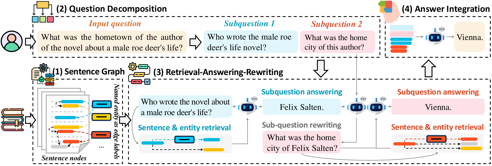

# ChainRAG
This is the official code release of the following paper:

Rongzhi Zhu, Xiangyu Liu, Zequn Sun, Yiwei Wang, Wei Hu: Mitigating Lost-in-Retrieval Problems in Retrieval Augmented Multi-Hop Question Answering, ACL 2025

In this paper, we identify a critical problem, "lost-in-retrieval", in retrieval-augmented multi-hop question answering (QA): the key entities are missed in LLMs' sub-question decomposition. 
"Lost-in-retrieval" significantly degrades the retrieval performance, which disrupts the reasoning chain and leads to the incorrect answers. 
To resolve this problem, we propose a progressive retrieval and rewriting method, namely ChainRAG, which sequentially handles each sub-question by completing missing key entities and retrieving relevant sentences from a sentence graph for answer generation. Each step in our retrieval and rewriting process builds upon the previous one, creating a seamless chain that leads to accurate retrieval and answers. Finally, all retrieved sentences and sub-question answers are integrated to generate a comprehensive answer to the original question. We evaluate ChainRAG on three multi-hop QA datasets—MuSiQue, 2Wiki, and HotpotQA—using three large language models: GPT4o-mini, Qwen2.5-72B, and GLM-4-Plus. Empirical results demonstrate that ChainRAG consistently outperforms baselines in both effectiveness and efficiency.



## Data

- **To reproduce our results**:  
  Use the data in `/data` and `/processed_data` (required for HippoRAG/LongRAG).  
  Run the provided scripts without modification.

- **Using your own data**:  
  Place files in `/data`.  
  Ensure matching file formats and adjust paths if needed.

## Code Structure

This repository is organized into the following modules:

### `utils.py`
Contains foundational utility functions for:
- Stores and retrieves context embeddings
- Common file operations and format conversions

### `LLM.py`
Provides interfaces for language model interactions:
- Wrapper functions for LLM and Embedding models API calls

### `sentence_graph.py`
Handles all sentence graph construction operations:
- Handles sentence splitting and entity extraction
- Generates and fetches sentence embeddings
- Builds sentence graphs from text  
  → Note: Nodes represent sentences, edges show connections between sentences (3 relationships mentioned in paper)
- Analyzes and decomposes the question
- Other supporting functions

### `retrieval.py`
Implements the retrieval components:
- Retrieves seed sentences and expands context within the sentence graph
- Rewrites the sub-question
- Answers original question
- Other supporting functions

### `evaluate.py`
Provides evaluation capabilities:
- Calculates F1 and EM scores

## Quick Start

### Environment Setup

1. Create conda environment:
   ```bash
   conda create -n chainrag python=3.10 -y
   conda activate chainrag

   pip install -r requirements.txt

   # Install spaCy and download the English model
   python -m spacy download en_core_web_sm
   
   # If faiss-cpu installation fails via pip:
   conda install -c conda-forge faiss-cpu
   ```

2. Configure Models and API Keys
   - Replace the default models in LLM.py with your custom models (if needed)
   - Configure required API keys in `retrieval.py` by editing the values at the top of the file

### Running ChainRAG

To run the retrieval system, use the following command:

```bash
python retrieval.py [OPTIONS]
```

#### Command Line Options

- `--dataset DATASET`: Specifies which dataset to use for the retrieval task. Available options include "hotpotqa", "musique", and "2wikimqa". Default is "musique".
  
- `--no_cache`: Disables the caching of embeddings. By default, the system caches embeddings to improve performance on subsequent runs with the same dataset.

#### Examples

Run with default settings (musique dataset with caching enabled):
```bash
python retrieval.py
```

Run with a specific dataset:
```bash
python retrieval.py --dataset hotpotqa
```

Run with caching disabled:
```bash
python retrieval.py --no_cache
```

Run with a specific dataset and caching disabled:
```bash
python retrieval.py --dataset 2wikimqa --no_cache
```

The system will process the questions in the specified dataset, showing a progress bar with statistics like LLM calls, context length, and processing time (optional). After completion, a summary of average statistics will be displayed.

## Citation
If you find the repository helpful, please cite the following paper.
```bibtex
@inproceedings{ChainRAG,
  author = {Rongzhi Zhu and
            Xiangyu Liu and
            Zequn Sun and
            Yiwei Wang and
            Wei Hu},
  title = {Mitigating Lost-in-Retrieval Problems in Retrieval Augmented Multi-Hop Question Answering},
  booktitle = {ACL},
  year = {2025}
}
```
